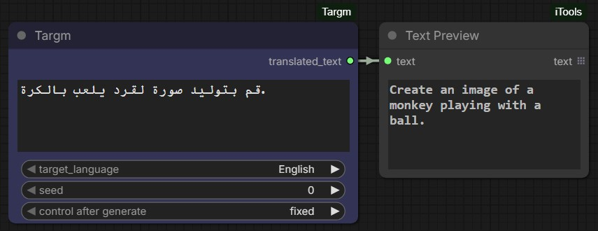

# ComfyUI-Targm

A ComfyUI custom node for high-quality text translation using Tencent's **HY-MT1.5-1.8B-FP8** model. This node is specifically designed to handle broad translation tasks across 36+ languages, making it ideal for translating prompts or descriptions within your ComfyUI workflows.



## Features

- **High Performance**: Uses the FP8 quantized version of HY-MT1.5 (1.8B parameters) for fast inference and lower VRAM usage.
- **Multilingual Support**: Supports 36 languages including Arabic, Chinese, English, Japanese, French, and many more.
- **Auto-Download**: Automatically downloads the necessary model files from Hugging Face on first use.
- **Lazy Loading**: The model is loaded into memory only when needed and cached for subsequent runs.

## Supported Languages

English, Arabic, Bengali, Burmese, Chinese, Czech, Dutch, French, German, Gujarati, Hebrew, Hindi, Indonesian, Italian, Japanese, Kazakh, Khmer, Korean, Malay, Marathi, Mongolian, Persian, Polish, Portuguese, Russian, Spanish, Tagalog, Tamil, Telugu, Thai, Tibetan, Turkish, Ukrainian, Urdu, Uyghur, Vietnamese.

## Installation

1. Head to `ComfyUI/custom_nodes` directory and clone this repository
   ```bash
   git clone https://github.com/MohammadAboulEla/ComfyUI-Targm.git
   ```
2. Head to `ComfyUI-Targm` directory and Install the required dependencies (python_embeded):
   ```bash
   ../../../python_embeded/python.exe -m pip install -r requirements.txt
   ```

## Usage

1. Add the **Targm** node in ComfyUI (Found under the `Targm` category).
2. **Inputs**:
   - `text`: The text you want to translate (supports multiline).
   - `target_language`: Select the destination language from the dropdown.
3. **Outputs**:
   - `translated_text`: The resulting translated string.

## Model Credit

Based on [tencent/HY-MT1.5-1.8B-FP8](https://huggingface.co/tencent/HY-MT1.5-1.8B-FP8).

Support me on PayPal
--------------------
[](https://paypal.me/mohammadmoustafa1)